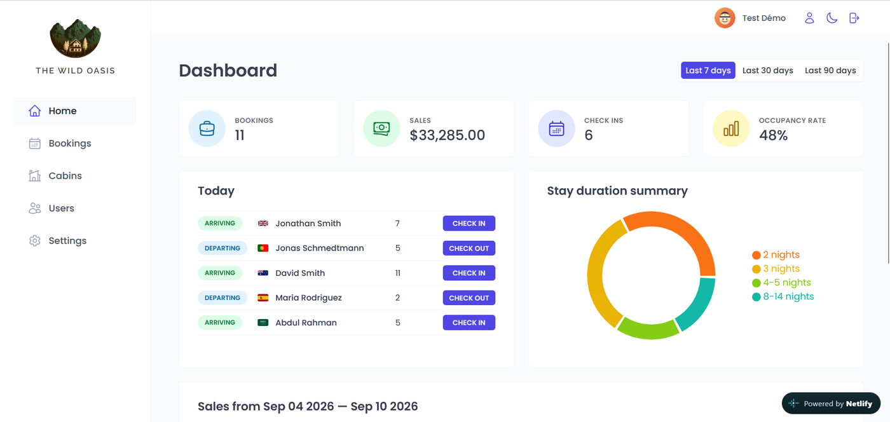
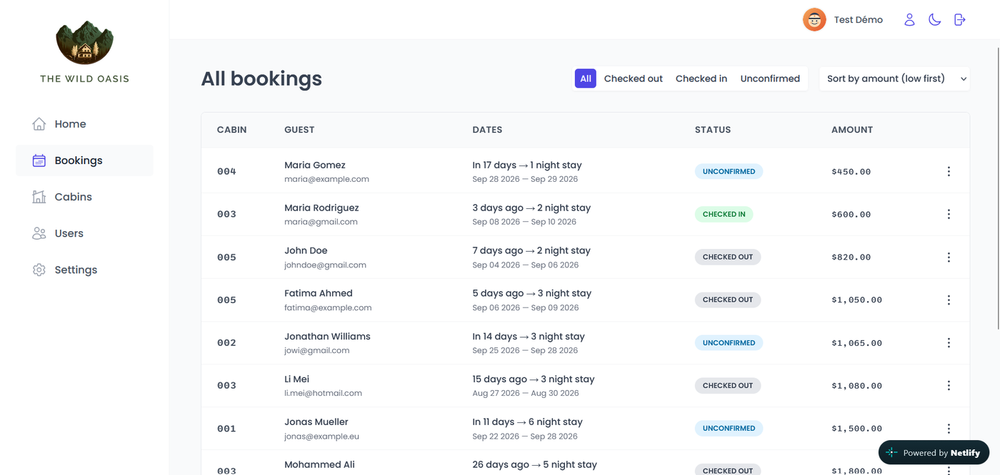
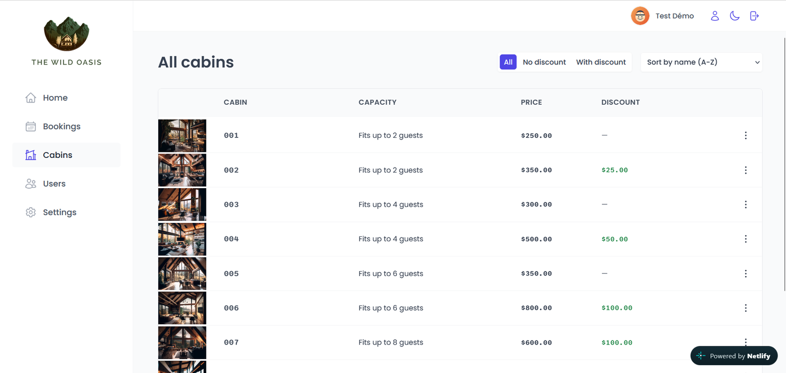
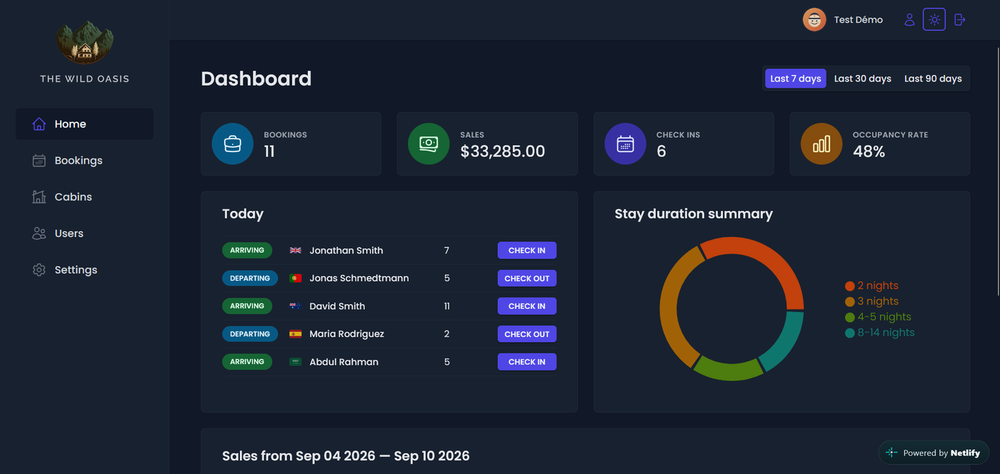

# The Wild Oasis

🇬🇧 English | [🇫🇷 Français](./README.fr.md)

Hotel management dashboard for internal staff — bookings, check-in/check-out, cabins and guests, built with React, React Query and Supabase.

## Live demo

**[wild-oasis-maroon7-slideshow9.netlify.app](https://wild-oasis-maroon7-slideshow9.netlify.app)** — auto-deployed from `main` via Netlify (CI/CD on every push).

This is an internal staff tool: every signed-in user sees and can edit the same shared data (bookings, cabins, guests), and public sign-up on the project is disabled by design (see [Security](#security)). So there's no self-service demo account to hand out — get in touch and I'll send you a login. Reach me through [dan0203.github.io](https://dan0203.github.io).

Because the account is shared, data you see may have been added, edited or removed by someone else who tried the demo before you — if something looks off, that's most likely why, not a bug.

## Screenshots



<table>
<tr>
<td></td>
<td></td>
</tr>
<tr>
<td align="center"><sub>Bookings — filter, sort, check-in/check-out</sub></td>
<td align="center"><sub>Cabins — CRUD with image upload and discounts</sub></td>
</tr>
</table>

<details>
<summary>Dark mode</summary>

</details>

## Features

- **Dashboard** — bookings/sales/check-ins/occupancy KPIs, stay-duration breakdown, sales chart over a selectable period
- **Bookings** — list with filtering by status and sorting, detail view, check-in and check-out flow
- **Cabins** — CRUD with image upload, capacity and discount pricing
- **Users** — staff account management (admin-gated, see [Security](#security))
- **Settings** — booking rules (min/max nights, max guests, breakfast price)
- Dark mode

## Tech stack

React (Vite) · React Query · Supabase (Postgres, Auth, Storage) · react-hook-form · styled-components · recharts

## Running locally

**Prerequisites:** Node 18+ and a Supabase project.

```bash
git clone https://github.com/dan0203/wild-oasis.git
cd wild-oasis
npm install
```

Create a `.env` file at the project root (see `.env.example`):

```
VITE_SUPABASE_URL=your-supabase-project-url
VITE_SUPABASE_KEY=your-supabase-anon-key
```

```bash
npm run dev
```

Variables must be prefixed with `VITE_` — that's a Vite requirement for exposing them to client-side code. The anon/publishable key is meant to be public in the client bundle; the actual access control lives in Supabase's Row Level Security, not in the key itself (see below).

## Security

- **Row Level Security (RLS)** restricts every read/write on `bookings`, `cabins`, `guests` and `settings` to the `authenticated` role. That's the right model for a single-property internal tool where any signed-in staff member should see all the data — unlike a multi-tenant app where users only see their own records.
- **Public sign-up is disabled** on the Supabase project. `authenticated` alone isn't a real boundary while sign-up is open: `supabase.auth.signUp()` is a public endpoint that can be called directly (e.g. with `curl`), regardless of what the React app's `ProtectedRoute` hides in the UI — a client-side route guard doesn't stop a direct API call. This was identified and fixed, then verified two independent ways: a direct call to `POST /auth/v1/signup` now returns `422 signup_disabled`, and the app's own "Create user" form returns the same error when used while signed in. New staff accounts are added manually from the Supabase dashboard for now — the in-app form is intentionally left visible rather than removed, since the failure is the security boundary working as intended, not a bug.

## Git workflow

65 commits developed across feature branches (`feature/auth`, `feature/dashboard`, `feature/bookings-table`, `feature/api-filter-sort-pagination`, `feature/dark-mode`, `fix/error-handling`, …), merged into `main`.

## About this project

Built as the capstone project of *The Ultimate React Course 2025* (Jonas Schmedtmann).

## License

[MIT](./LICENSE)
